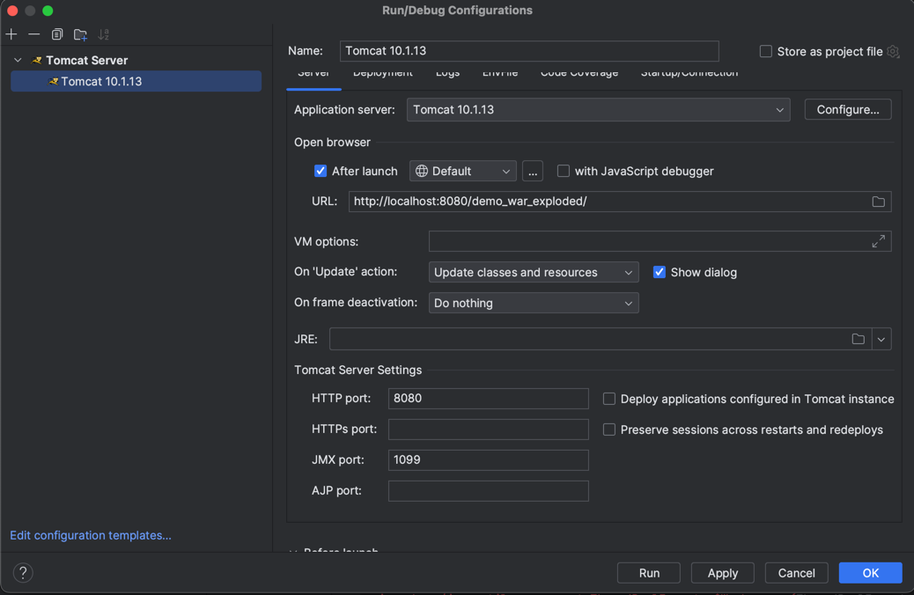

# Prerequisites 
<b>Tomcat</b>
<b>Mysql and Mysql workbench (optional)
# How to Run The Code

1. Pull the project from GitHub
2. On intellij create a new run configuration for tomcat

3. First create a new Scheme called jeoparody
4. Run the JEOPARODY_DATABASE.sql file in your workbench to create the database needed
5. Add your mysql password and username into the servlets (Category, Game, InputQuestions, Language, Login, Signup)
6. Run the tomcat server and a window with the homepage of the application should
automatically be opened

# Web Sockets
Done by: Will Ondrik

## Socket code locations:
### Files:
- `socket.js` (front-end socket connection)
- `SocketServlet.java` (back-end socket configurations)
- `mode.js` (posts the selected game type to ModeServlet.java)
- `ModeServlet.java` (stores the game type and informs the front-end)
- `game.js` (sends socket messages to the SocketServlet)
    - lines 1-3
    - `checkAnswer` function
        - lines 139-141
        - lines 148-150
        - lines 153-156
        - lines 160-162

# Game Logic
Done by: Gathrean Dela Cruz and Bardia Timouri (Score servlet and back buttons: Laurie Solkoski)
### Files
- `game.js`, `game.html`, `game.css`, `index.html`, `index.css`, `index.js, 'score.html', 'score.js'
    - Created front end for home page (Bardia)
    - Front-end Client (Ean)
    - Functions to show the user what question they are on, got wrong, got right (Bardia)
    - Functions to go next, and prev (Ean)
    - Functions to keep track of the score (Ean)
    - Function to update images and questions and options from the JSON array (Bardia)
    - Made use of AJAX to dynamically update questions to the (Bardia)
    - Used JS fetch function to retrieve questions and images in array format from GameServlet (Bardia)
- `LanguageServlet` and `CategoryServlet` 
    - First and second step before starting the game, respectively (Ean)
    - Redirects to GameServlet when both language ID and category ID as sent as parameters (Bardia)
- `GameServlet`
    1. Receives language and cateogry IDs, and fetches appropriates questions from database (Bardia)
    2. Organize data into JSON arrays and sends the JSON response back to client (Ean)
    3. Handles AJAX requests for the quiz and provide data (Bardia)
    4. Then presents the questions and options to the user in the game frontend (Ean)
- 'DisplayServlet'
    - Used doGet to display the game screen (Bardia)
-  'ScoreServlet.java' (This fetches and displays a score from "/score" URL, and, in case of an error, logs it to the console and shows an error message in the "scoreDisplay" HTML element.) (Laurie)
-  'Score.html' and 'Score.js'
  - a score display page for the game, presenting users their scores with appropriate messages based on their performance. The HTML body incorporates a script section which processes the score, calculates the percentage, and constructs a message reflecting the user's achievement, while providing an option to exit the game and redirect to the main menu, closing any open WebSocket connection.
  - Separately, the window.onload JavaScript function fetches the score from the server on page load using the Fetch API, displaying it to the user and handling any errors encountered during the fetch operation, emphasizing both user interface aesthetics and functionality for game interaction and user experience.

 
# Quiz Question Upload/Management
Done by: Gathrean Dela Cruz and Hyuk Park
### Files
- `InputQuestionServlet.java`
  - Creates a query that will submit information regarding new question into local database (category, language, etc..) (Hyuk)
  - Loads front end html and styling to user (Hyuk)
  - Handles authentication and ensure user is logged in prior to submitting, redirects user to login if otherwise (Hyuk)
- `ListAndDeleteQuestionsServlet.java`
  - Creates a query that retrieves all the questions in the quiz from the local database and presents them on the page (Hyuk)
  - Each question has the option to be deleted, which is done through another query and use of the question ID (Hyuk)
  - Page is reloaded after changes to reflect that deletion was successful (Hyuk)
- `submit.css`, `submit.html`, `submit.js`, `questions.html`
  - Front-end Client (Ean)
  - Function for drop down selection for categories and languages (Hyuk)
  - Initial structure and styling for Front-end Client (Hyuk)

# Database Schema and mySQL
Done by: Laurie Solkoski
## File: 
 - JEOPARODY_DATABASE.sql
  - This SQL script is the basis of the JEOPARODY quiz game. The script structures a multilingual quiz application database by creating Languages, Categories, Questions, and Options tables, establishing one to many relationships and foreign keys among them to maintain data integrity.
  - It then populates these tables with sample data representing quiz questions in different languages, each associated with specific categories. 
  - The schema is structured so that there is a one-to-many relationship between all tables through normalization. I thought the design was better suited to have each game entity as its own table, instead of creating indiidual tables for each game category.
  - The chosen data types in the script utlizes  AUTO_INCREMENT for uniqueness, VARCHAR for storing variable character strings like names and texts, MEDIUMBLOB for storing image location data, and BOOLEAN to store binary valued attributes.    
  

# Contributions List
- Aulakh, Ravdeep
    - []
- Dela Cruz, Gathrean (Ean)
    - Game Logic and Frontend
    - Allowing the frontend to recieve questions from the backend
    - Game design
- Park, Hyuk
    - Quiz question Upload Page (Front-end/back-end)
      - Allowing frontend page to send a quiz question into the database from the backend
    - Quiz question Management Page (Back-end)
      - Allowing page to retrieve quiz question from the local database from the backend
- Ondrik, Will
    - Web Sockets
- Solkoski, Laurie
    - SQL database and schema where quiz logic is fetching from
    - Logic for Score page
    - Some frontend for general exit, back, main menu buttons
- Timouri, Bardia
    - Game Logic and Frontend
    - Allowing the frontend to recieve questions from the backend
    - Allowing the frontend to display images gathered from backend
    - Gathering questions and answers in english
    - Mid fidelity wireframe for home screen
    - Game design
      

